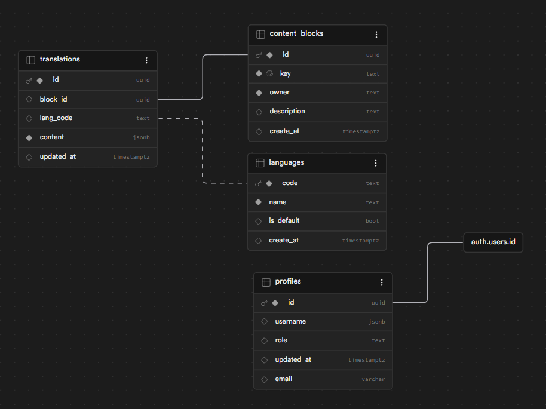

# 🗃️ Base de datos — Centeno Advisory

Documentación del schema PostgreSQL que consume la plataforma
[Centeno Advisory](../). El schema vive en un proyecto Supabase y
está modelado para soportar contenido multiidioma (i18n) por bloques
editables, perfiles de usuario con roles, y un mini-blog con traducciones.

> **Cómo leer este README**: el diagrama ER te da el mapa general; las
> tablas están detalladas con sus columnas y constraints; al final tienes
> las políticas RLS y el SQL listo para correr.

---

## 📋 Tabla de contenidos

- [Diagrama ER](#-diagrama-er)
- [Qué hace esta base de datos](#-qué-hace-esta-base-de-datos)
- [Resumen del schema](#-resumen-del-schema)
- [Tablas](#-tablas)
  - [`content_blocks`](#content_blocks)
  - [`languages`](#languages)
  - [`profiles`](#profiles)
  - [`translations`](#translations)
  - [`posts`](#posts)
  - [`post_translations`](#post_translations)
- [Relaciones (Foreign Keys)](#-relaciones-foreign-keys)
- [Función RPC](#-función-rpc)
- [Trigger de perfil automático](#-trigger-de-perfil-automático)
- [RLS (Row Level Security)](#-rls-row-level-security)
- [Cómo replicarlo](#-cómo-replicarlo)
- [Estructura de archivos](#-estructura-de-archivos)

---

## 🗺️ Diagrama ER



---

## 🎯 Qué hace esta base de datos

La app de Centeno Advisory carga su landing en función de **bloques de contenido** (hero, servicios, equipo, etc.), cada uno con traducciones por idioma. La base de datos hace 4 cosas concretas:

1. **Catálogo de bloques editables** (`content_blocks`) — cada sección de la landing es un bloque con un `key` único.
2. **Contenido por idioma** (`translations` + `languages`) — un JSON por (bloque, idioma) que la landing renderiza.
3. **Autenticación con roles** (`profiles`) — perfil automático al registrarse; el rol `admin` da acceso al panel de edición.
4. **Blog con posts traducidos** (`posts` + `post_translations`) — modelo listo para publicar artículos multiidioma.

El corazón de todo es la **función RPC `get_translation_by_key`**: la app la llama con `(block_key, lang)` y recibe el JSON del bloque en ese idioma.

---

## 📊 Resumen del schema

- **6 tablas** en el schema `public`
- **5 foreign keys** (todas `ON DELETE CASCADE`)
- **2 unique constraints** extra (en `post_translations`)
- **3 funciones** (1 RPC + 1 trigger helper + 1 event trigger gestionado por Supabase, **NO incluido** en `schema.sql`)
- **1 trigger** relevante (`on_auth_user_created`)
- **6 políticas RLS** (lectura pública + admin write)

---

## 📊 Tablas

### `content_blocks`

Catálogo de bloques editables de la landing. Cada bloque tiene un `key`
único legible (`home_hero_section`, `differentiator_article`, etc.) que
la app usa para pedir su contenido.

| Columna | Tipo | Nullable | Default | Notas |
|---|---|---|---|---|
| `id` | `uuid` | NO | `gen_random_uuid()` | **PK** |
| `key` | `text` | NO | — | **UNIQUE**. Slug legible |
| `owner` | `text` | NO | — | Quién es el dueño del bloque |
| `description` | `text` | Sí | `NULL` | Descripción legible |
| `create_at` | `timestamptz` | Sí | `now()` | ⚠️ Typo: debería ser `created_at` |

---

### `languages`

Catálogo de idiomas disponibles en la plataforma.

| Columna | Tipo | Nullable | Default | Notas |
|---|---|---|---|---|
| `code` | `text` | NO | — | **PK**. Código BCP-47 (`es`, `en`) |
| `name` | `text` | NO | — | Nombre legible |
| `is_default` | `boolean` | Sí | `false` | Marca el idioma por defecto |
| `create_at` | `timestamptz` | Sí | `now()` | ⚠️ Typo: debería ser `created_at` |

---

### `profiles`

Perfil de cada usuario de `auth.users`. Se crea automáticamente al
registrarse (vía el trigger `on_auth_user_created`).

| Columna | Tipo | Nullable | Default | Notas |
|---|---|---|---|---|
| `id` | `uuid` | NO | — | **PK** + **FK** → `auth.users.id` CASCADE |
| `username` | `jsonb` | Sí | `NULL` | Nombre en formato JSON (`{"display_name": "..."}`) |
| `role` | `text` | Sí | `'client'` | `admin` \| `client` |
| `updated_at` | `timestamptz` | Sí | `now()` | |
| `email` | `varchar` | Sí | `NULL` | Cache del email |

Para promover a admin: `UPDATE profiles SET role='admin' WHERE id='<uuid>';`

---

### `translations`

El contenido real de la landing: una fila por cada (bloque, idioma).
Aquí vive el JSON que la app renderiza.

| Columna | Tipo | Nullable | Default | Notas |
|---|---|---|---|---|
| `id` | `uuid` | NO | `gen_random_uuid()` | **PK** |
| `block_id` | `uuid` | Sí | `NULL` | **FK** → `content_blocks.id` CASCADE |
| `lang_code` | `text` | Sí | `NULL` | **FK** → `languages.code` CASCADE |
| `content` | `jsonb` | NO | — | El JSON con el contenido del bloque en ese idioma |
| `updated_at` | `timestamptz` | Sí | `now()` | |

**Unique**: `(block_id, lang_code)` — no puede haber duplicados del mismo bloque en el mismo idioma.

---

### `posts`

Catálogo de posts/artículos del blog.

| Columna | Tipo | Nullable | Default | Notas |
|---|---|---|---|---|
| `id` | `uuid` | NO | `gen_random_uuid()` | **PK** |
| `author_id` | `uuid` | Sí | `NULL` | UUID del autor (no tiene FK — agregarla si lo necesitas) |
| `image_url` | `text` | Sí | `NULL` | URL de la imagen destacada |
| `status` | `text` | Sí | `'draft'` | `draft` \| `published` \| lo que sea |
| `created_at` | `timestamptz` | Sí | `now()` | |

---

### `post_translations`

Traducciones de los posts. Una fila por (post, idioma).

| Columna | Tipo | Nullable | Default | Notas |
|---|---|---|---|---|
| `id` | `uuid` | NO | `gen_random_uuid()` | **PK** |
| `post_id` | `uuid` | Sí | `NULL` | **FK** → `posts.id` CASCADE |
| `lang_code` | `text` | Sí | `NULL` | **FK** → `languages.code` CASCADE |
| `title` | `text` | NO | — | Título del post en este idioma |
| `slug` | `text` | NO | — | **UNIQUE**. Slug del post |
| `body` | `text` | NO | — | Contenido del post |

**Uniques**: `(post_id, lang_code)` y `slug`.

---

## 🔗 Relaciones (Foreign Keys)

```
auth.users (id) ───────► profiles (id)                  ON DELETE CASCADE

posts (id) ────────────► post_translations (post_id)    ON DELETE CASCADE

languages (code) ──────► post_translations (lang_code) ON DELETE CASCADE

content_blocks (id) ───► translations (block_id)        ON DELETE CASCADE

languages (code) ──────► translations (lang_code)       ON DELETE CASCADE
```

| Origen | → | Destino | ON DELETE |
|---|---|---|---|
| `profiles.id` | → | `auth.users.id` | CASCADE |
| `post_translations.post_id` | → | `posts.id` | CASCADE |
| `post_translations.lang_code` | → | `languages.code` | CASCADE |
| `translations.block_id` | → | `content_blocks.id` | CASCADE |
| `translations.lang_code` | → | `languages.code` | CASCADE |

---

## ⚡ Función RPC

### `get_translation_by_key(block_key text, lang text)`

Devuelve el `content` (jsonb) de un bloque en un idioma.

**Uso desde la app:**

```ts
const { data } = await supabase.rpc('get_translation_by_key', {
  block_key: 'home_hero_section',
  lang: 'es',
});
```

Si no existe el bloque o el idioma, retorna `null`. La app lo usa **en cada
request del Server Component** de la landing.

---

## ⚡ Trigger de perfil automático

```sql
CREATE TRIGGER on_auth_user_created
  AFTER INSERT ON auth.users
  FOR EACH ROW
  EXECUTE FUNCTION public.handle_new_user();
```

Cuando un usuario nuevo se registra en `auth.users`, la función
`handle_new_user()` inserta automáticamente una fila en `profiles` con:

- `id` = el UUID del usuario
- `username` = el `display_name` de los metadatos de auth (o `'Usuario Nuevo'` si no hay)
- `role` = `'client'` (por defecto; cambiar manualmente a `'admin'` después)

> **Nota técnica**: `handle_new_user` es `SECURITY DEFINER` y fija
> `search_path TO 'public'` para evitar hijacking. Esto es necesario porque
> dentro de un trigger sobre `auth.users`, `auth.uid()` se comporta
> distinto y necesitamos bypasear RLS para insertar en `profiles`.

---

## 🔐 RLS (Row Level Security)

**RLS habilitado en las 6 tablas.**

### Policies (6)

| # | Tabla | Policy | Cmd | Roles | `USING` |
|---|---|---|---|---|---|
| 1 | `content_blocks` | `public read acces` | ALL | `public` | `true` |
| 2 | `profiles` | `public read acces` | ALL | `public` | `true` |
| 3 | `post_translations` | `public read acces post` | SELECT | `public` | `true` |
| 4 | `post_translations` | `admin access` | ALL | `authenticated` | `auth.uid() = '<admin-uuid>'` |
| 5 | `translations` | `public read acces` | SELECT | `public` | `true` |
| 6 | `translations` | `admin access` | ALL | `authenticated` | `auth.uid() = '<admin-uuid>'` |

> **Lectura pública** para los catálogos y el contenido de la landing.
> **Escritura solo para admin** (UUID hardcodeado en `schema.sql`; reemplázalo por el tuyo).

⚠️ El UUID hardcodeado en las policies es el **único punto que tienes que
personalizar** al replicar este schema. Reemplaza `<admin-uuid-aqui>` por
el UUID real del admin que crees en **Authentication → Users** de tu proyecto.

**Alternativa más mantenible**: cambiar la condición `auth.uid() = '<admin-uuid>'`
por una subquery a `profiles.role = 'admin'` (así no tienes que cambiar la
policy cada vez que rotes admins).

---

## 🚀 Cómo replicarlo

```bash
# 1. Crea un proyecto en https://supabase.com

# 2. En el SQL Editor, abre un nuevo query y pega el contenido de schema.sql

# 3. ANTES de correrlo, reemplaza '<admin-uuid-aqui>' por el UUID real:
#    - Crea un usuario en Authentication → Users (será tu admin)
#    - Copia su UUID
#    - Reemplaza en las 2 policies "admin access"

# 4. Ejecuta el SQL completo

# 5. Pobla los idiomas:
INSERT INTO public.languages (code, name, is_default) VALUES
  ('es', 'Español',  true),
  ('en', 'English', false);

# 6. Empieza a insertar traducciones:
INSERT INTO public.translations (block_id, lang_code, content) VALUES
  ((SELECT id FROM public.content_blocks WHERE key='home_hero_section'),
   'es',
   '{"title": "Hola", "subtitle": "Mundo"}'::jsonb);

# 7. (Opcional) Promueve al usuario a admin:
UPDATE public.profiles SET role='admin' WHERE id='<tu-uuid>';
```

> El schema **NO incluye** objetos internos de Supabase (`auth.users`,
> `storage.buckets`, `realtime.subscription`, ni el event trigger
> `rls_auto_enable`). Esos los gestiona Supabase automáticamente.

---

## 📁 Estructura de archivos

```
db/
├── README.md          ← este archivo (documentación humana)
├── schema.sql          ← DDL listo para correr en el SQL Editor de Supabase
└── er-diagram.png      ← diagrama entidad-relación (imagen)
```

---

**Hecho con 🖤 por el equipo de Centeno Advisory**
